<!DOCTYPE html>
<html lang="id">
<head>
    <meta charset="UTF-8">
    <meta name="viewport" content="width=device-width, initial-scale=1.0">
    <title>Petualangan Pancasila - Game Edukasi</title>
    
</head>
<body>
    <!-- Balon-balon terbang -->
    

        
🎈

        
🎈

        
🎈

        
🎈

        
🎈

    

    <!-- Container konfetti -->
    

    <!-- Copyright Footer -->
    

        � 2025-2026 Media Ajar Pancasila 
        Milik Pengembang
    

    

        <!-- Halaman Pembuka -->
        

            
✨✨

            

                <h1>🇮🇩 Belajar Pancasila Yuk! 🇮🇩</h1>
                
Media pembelajaran interaktif untuk anak SD

            

            

                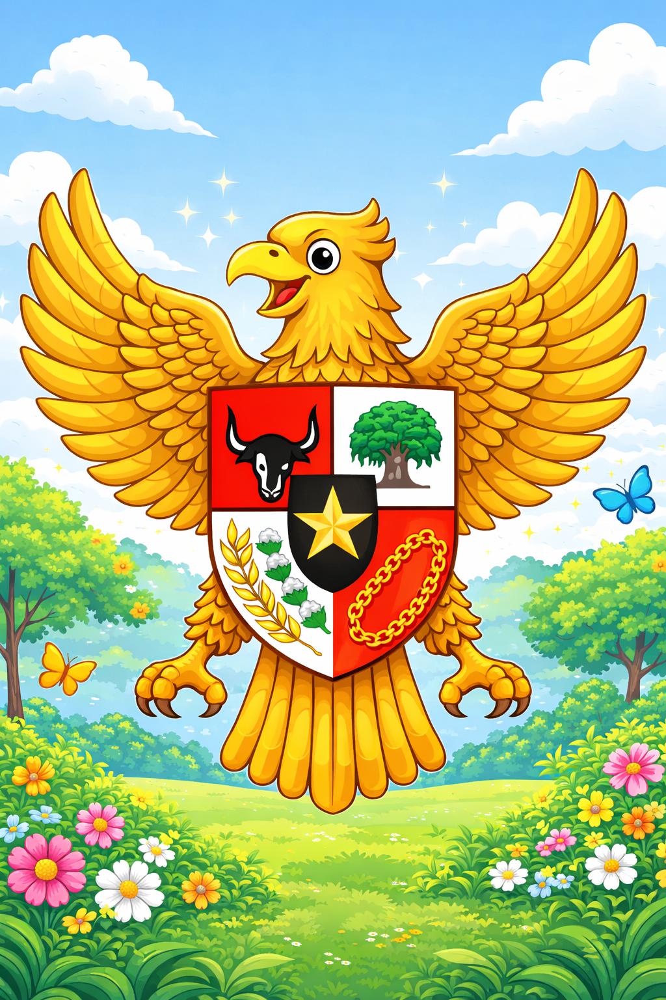
            

            

                <h2>Selamat Datang, Adik-adik!</h2>
                
Yuk, kita belajar tentang <strong>Pancasila</strong>, dasar negara Indonesia yang kita cintai!

                
Pancasila memiliki <strong>5 sila</strong> yang mengajarkan kita cara hidup yang baik.

                
Siap belajar? Ayo kita mulai petualangan seru kita!

            

            <button class="btn" onclick="goToPage('menu')">Mulai Belajar! 🚀</button>
            <button class="btn btn-secondary" onclick="goToGameMenu()" style="margin-top: 20px;">🎮 Mainkan Game Edukasi</button>
        

        <!-- Halaman Menu Pilihan Sila -->
        

            
⭐✨

            

                <h1>Pilih Sila yang Mau Dipelajari</h1>
                
Klik gambar untuk belajar

            

            
            <!-- Progress tracker -->
            

                

                

                

                

                

            

            

                

                    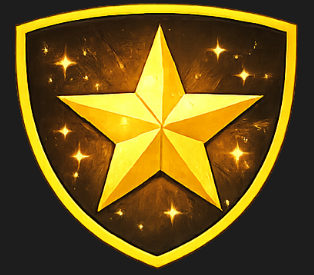
                    <h3>Sila Ke-1</h3>
                

                

                    
                    <h3>Sila Ke-2</h3>
                

                

                    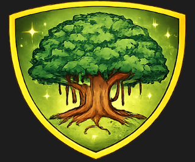
                    <h3>Sila Ke-3</h3>
                

                

                    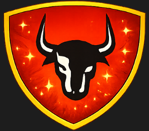
                    <h3>Sila Ke-4</h3>
                

                

                    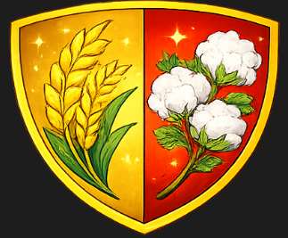
                    <h3>Sila Ke-5</h3>
                

            

            <!-- Card Belajar Semua -->
            

                
🚀

                <h3>Ayo Belajar Semua Sila!</h3>
                
Belajar dari Sila 1 sampai 5 secara berurutan

            

            <button class="btn btn-secondary" onclick="checkCompletion()">Selesai Belajar </button>
            <button class="btn" onclick="goToPage('intro')" style="margin-top: 10px; background: linear-gradient(135deg, #a29bfe 0%, #6c5ce7 100%);">🏠 Kembali ke Halaman Utama</button>
        

        <!-- Halaman Sila 1 -->
        

            

                <h1>Sila Ke-1</h1>
            

            

                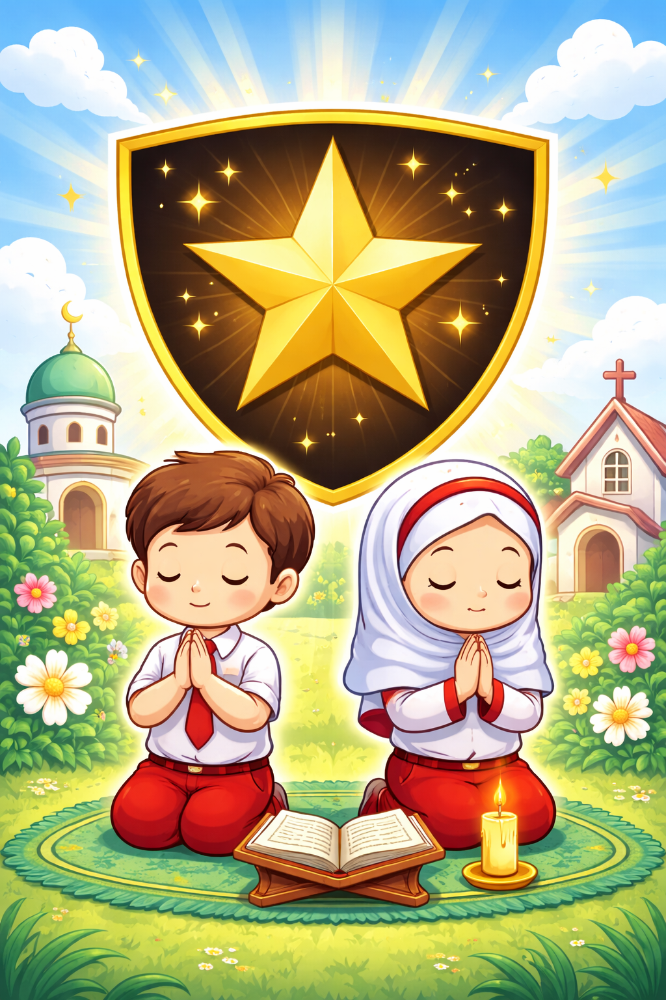
            

            

                <h2>Ketuhanan Yang Maha Esa</h2>
                
<strong>Artinya:</strong> Kita percaya kepada Tuhan Yang Maha Esa dan menghormati semua agama.

                
                <h3>Contoh Sikap di Sekolah:</h3>
                <ul>
                    <li>Berdoa sebelum dan sesudah belajar</li>
                    <li>Menghormati teman yang berbeda agama</li>
                    <li>Tidak mengganggu teman yang sedang beribadah</li>
                    <li>Rajin belajar agama dan mengamalkannya</li>
                </ul>
            

            <button class="btn" onclick="handleSilaNavigation(1)">Kembali ke Menu 🏠</button>
            <button class="btn btn-next" onclick="goToNextSila(1)">Lanjut ke Sila 2 ➡️</button>
        

        <!-- Halaman Sila 2 -->
        

            

                <h1>Sila Ke-2</h1>
            

            

                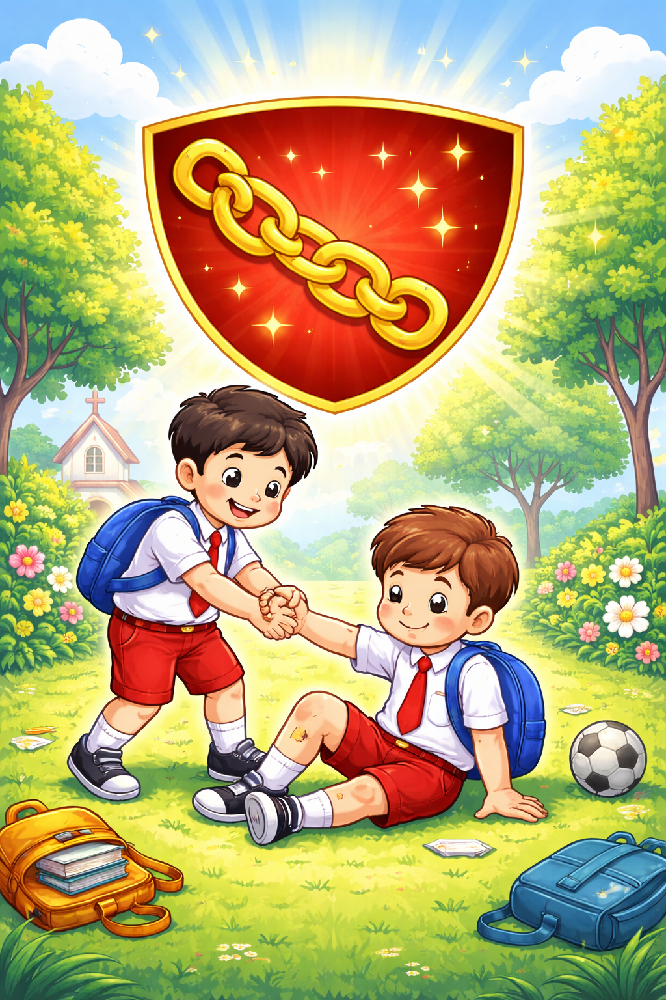
            

            

                <h2>Kemanusiaan yang Adil dan Beradab</h2>
                
<strong>Artinya:</strong> Kita harus memperlakukan semua orang dengan baik, adil, dan sopan.

                
                <h3>Contoh Sikap di Sekolah:</h3>
                <ul>
                    <li>Menolong teman yang kesusahan</li>
                    <li>Tidak membeda-bedakan teman</li>
                    <li>Berbicara dengan sopan kepada siapa saja</li>
                    <li>Menghargai pendapat orang lain</li>
                </ul>
            

            <button class="btn" onclick="handleSilaNavigation(2)">Kembali ke Menu 🏠</button>
            <button class="btn btn-next" onclick="goToNextSila(2)">Lanjut ke Sila 3 ➡️</button>
        

        <!-- Halaman Sila 3 -->
        

            

                <h1>Sila Ke-3</h1>
            

            

                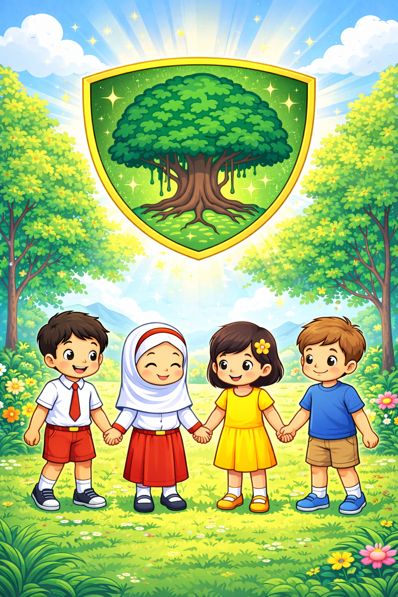
            

            

                <h2>Persatuan Indonesia</h2>
                
<strong>Artinya:</strong> Kita harus bersatu sebagai bangsa Indonesia meskipun berbeda suku, agama, dan budaya.

                
                <h3>Contoh Sikap di Sekolah:</h3>
                <ul>
                    <li>Berteman dengan semua teman tanpa pilih-pilih</li>
                    <li>Bekerja sama dalam kelompok</li>
                    <li>Menjaga nama baik sekolah</li>
                    <li>Ikut upacara dengan tertib</li>
                </ul>
            

            <button class="btn" onclick="handleSilaNavigation(3)">Kembali ke Menu 🏠</button>
            <button class="btn btn-next" onclick="goToNextSila(3)">Lanjut ke Sila 4 ➡️</button>
        

        <!-- Halaman Sila 4 -->
        

            

                <h1>Sila Ke-4</h1>
            

            

                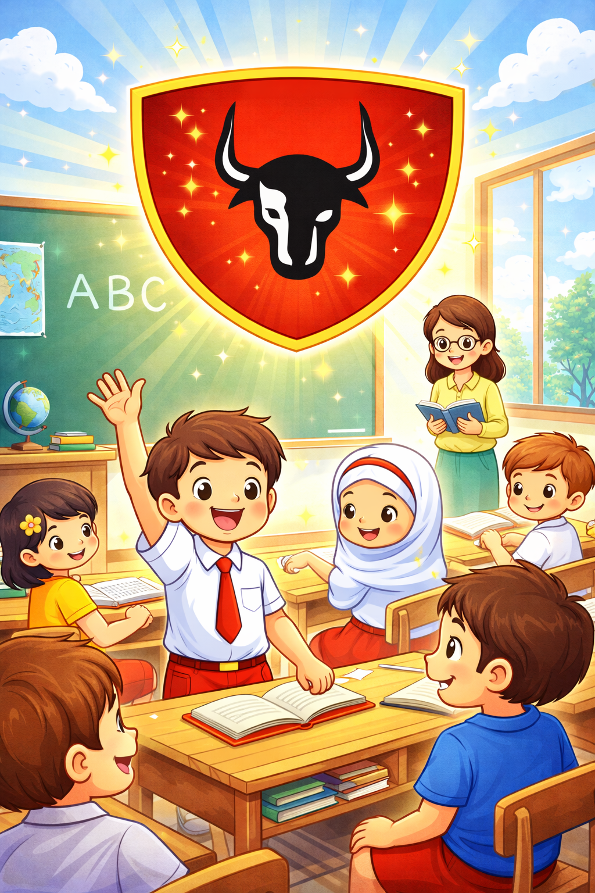
            

            

                <h2>Kerakyatan yang Dipimpin oleh Hikmat Kebijaksanaan dalam Permusyawaratan/Perwakilan</h2>
                
<strong>Artinya:</strong> Kita menyelesaikan masalah dengan musyawarah dan menghargai keputusan bersama.

                
                <h3>Contoh Sikap di Sekolah:</h3>
                <ul>
                    <li>Memilih ketua kelas dengan cara voting</li>
                    <li>Mendengarkan pendapat teman saat diskusi</li>
                    <li>Menerima keputusan yang sudah disepakati bersama</li>
                    <li>Menyelesaikan masalah dengan bicara baik-baik</li>
                </ul>
            

            <button class="btn" onclick="handleSilaNavigation(4)">Kembali ke Menu 🏠</button>
            <button class="btn btn-next" onclick="goToNextSila(4)">Lanjut ke Sila 5 ➡️</button>
        

        <!-- Halaman Sila 5 -->
        

            

                <h1>Sila Ke-5</h1>
            

            

                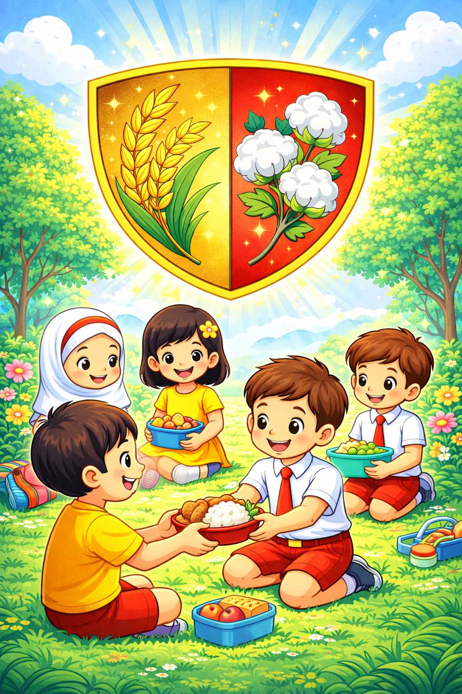
            

            

                <h2>Keadilan Sosial bagi Seluruh Rakyat Indonesia</h2>
                
<strong>Artinya:</strong> Semua orang Indonesia harus diperlakukan dengan adil dan mendapat kesempatan yang sama.

                
                <h3>Contoh Sikap di Sekolah:</h3>
                <ul>
                    <li>Tidak pelit berbagi dengan teman</li>
                    <li>Membantu teman yang kurang mampu</li>
                    <li>Tidak sombong karena lebih pintar atau kaya</li>
                    <li>Memberikan kesempatan yang sama untuk semua teman</li>
                </ul>
            

            <button class="btn" onclick="handleSilaNavigation(5)">Kembali ke Menu 🏠</button>
            <button class="btn btn-next" onclick="finishAutoLearn()">Selesai!</button>
        

        <!-- Halaman Penutup -->
        

            
✨⭐🎉

            

                <h1>🎊 Selamat! 🎊</h1>
                
Kamu sudah selesai belajar!

            

            

                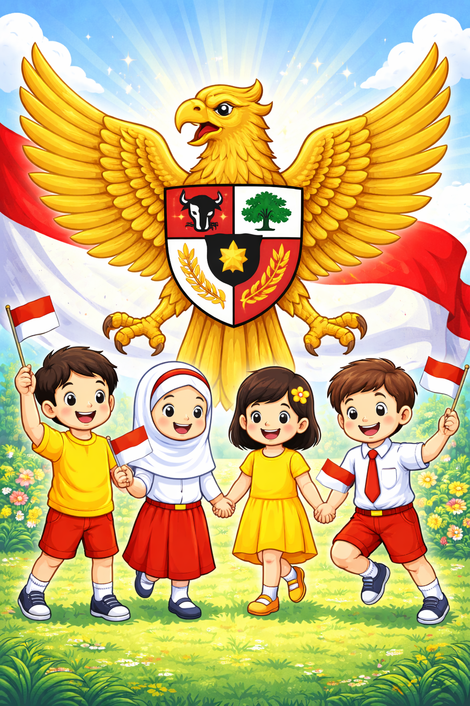
            

            

                
⭐

                <h2>Kamu Hebat!</h2>
                
Kamu sudah mempelajari semua nilai Pancasila!

                
<strong>Sekarang, yuk amalkan nilai-nilai Pancasila dalam kehidupan sehari-hari!</strong>

                
⭐

            

            

                <h3>Ingat ya, adik-adik:</h3>
                
Pancasila bukan hanya untuk dihafal, tapi untuk <strong>diamalkan setiap hari</strong>. Mari kita jadi anak Indonesia yang baik!

            

            <button class="btn" onclick="goToPage('intro')">Belajar Lagi 🔄</button>
        

        <!-- Game Menu Screen -->
        

            
⭐✨

            

                <h1>🎮 Game Pancasila</h1>
                
Pilih game favoritmu!

            

            

                

                    
🖼️

                    
Game 1

                    
Tebak Sila Dari Gambar

                    
Pilih gambar yang sesuai dengan soal!

                

                

                    
🎵

                    
Game 2

                    
Tebak Bunyi Sila

                    
Lihat gambar, pilih bunyi silanya!

                

            

            <button class="btn" onclick="goToPage('intro')" style="margin-top: 30px; width: 100%;">? Kembali ke Menu Utama</button>
        

        <!-- Game Screen -->
        

            

                

                    ? Skor:
                    0
                

                

                    ❤️ Nyawa:
                    3
                

            

            

            

                

                

                

            

            

                <h3 style="text-align: center; color: #6c5ce7; margin-bottom: 15px;">🎯 Mini Game</h3>
                

                

                

                    <button class="btn" onclick="checkMiniGame()">Cek Jawaban</button>
                

            

            

                <button class="btn" onclick="goToGameMenu()" style="flex: 1;">Kembali ke Menu</button>
                <button class="btn" onclick="nextLevel()" style="flex: 1;">Level Berikutnya ➡️</button>
            

        

        <!-- GAME 1: Match Image Screen -->
        

            

                <h1>🖼️ Game 1: Tebak Sila Dari Gambar!</h1>
                
Pilih gambar yang sesuai dengan pertanyaan!

            

            

                <!-- Akan diisi oleh JavaScript -->
            

            

                Soal: 1/5 | Benar: 0
            

            

                <button class="btn" onclick="goToGameMenu()">Kembali</button>
            

        

        <!-- GAME 2: Sound Match Screen -->
        

            

                <h1>Game 2: Tebak Bunyi Sila</h1>
                
Lihat gambar, lalu pilih bunyi sila yang benar!

            

            

                

                

                    
                

                

                

                <button class="btn" id="soundNextBtn" onclick="nextSoundQuestion()" style="display: none; width: 100%; margin-top: 15px;">Soal Berikutnya</button>
            

            

                Skor: 0 ⭐ | Benar: 0/5
            

            <button class="btn" onclick="goToGameMenu()" style="width: 100%;">Kembali ke Menu</button>
        

        <!-- Game Finish Screen -->
        

            

                
🎉

                <h2 class="title" style="color: #6c5ce7;">Selamat!</h2>
                
Kamu telah menyelesaikan semua level!

                

                
Kamu sudah menguasai Pancasila dengan baik! 🌟

                <button class="btn" onclick="resetGame()">Main Lagi</button>
            

        

    

    
</body>
</html>

